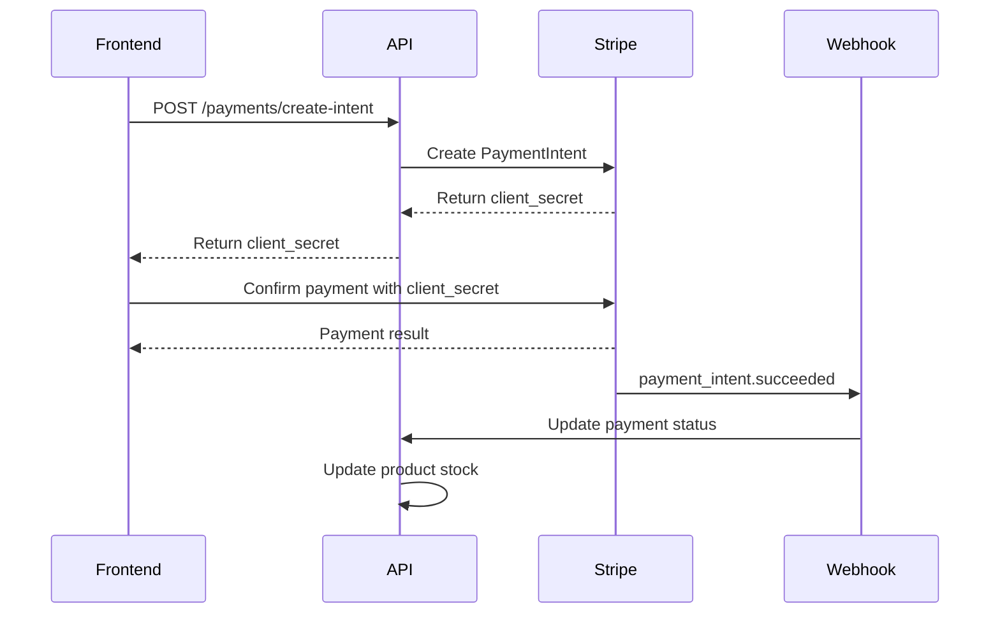

# Stripe Integration Guide

## Environment Variables

Add these environment variables to your `.env` file:

```bash
# Stripe Configuration
STRIPE_SECRET_KEY=sk_test_your_stripe_secret_key_here
STRIPE_PUBLISHABLE_KEY=pk_test_your_stripe_publishable_key_here
STRIPE_WEBHOOK_SECRET=whsec_your_webhook_secret_here

# Stripe URLs (customize these for your frontend)
STRIPE_SUCCESS_URL=http://localhost:3000/success
STRIPE_CANCEL_URL=http://localhost:3000/cancel
```

## Available Payment Endpoints

### Payment Management

1. **Create Payment Intent** - `POST /payments/create-intent`
   - Creates a payment intent for a product
   - Requires authentication (Bearer token)
   - Request Body:

   ```json
   {
     "productId": "60d0fe4f5311236168a109cb",
     "quantity": 2,
     "currency": "usd",
     "receiptEmail": "user@example.com",
     "metadata": {
       "orderId": "12345"
     }
   }
   ```

   - Response includes `clientSecret` for frontend payment processing

2. **Confirm Payment** - `POST /payments/confirm`
   - Confirms a payment with payment method
   - Requires authentication (Bearer token)
   - Request Body:

   ```json
   {
     "paymentIntentId": "pi_1234567890",
     "paymentMethodId": "pm_1234567890"
   }
   ```

3. **Get My Payments** - `GET /payments/my-payments`
   - Retrieves all payments for the authenticated user
   - Requires authentication (Bearer token)
   - Returns array of payment objects with status, amounts, and timestamps

4. **Get Payment by ID** - `GET /payments/:id`
   - Retrieves a specific payment by ID
   - Requires authentication (Bearer token)

5. **Stripe Webhook** - `POST /payments/webhook`
   - Handles Stripe webhook events for real-time payment updates
   - No authentication required (verified via webhook signature)
   - Processes events: `payment_intent.succeeded`, `payment_intent.payment_failed`

## Payment Flow



## Database Schema Changes

### User Entity (MySQL/TypeORM)

- Added `stripeCustomerId?: string` field to store Stripe customer ID

### Product Schema (MongoDB/Mongoose)

- Added `stripePriceId?: string` field to store Stripe price ID

### Payment Schema (MongoDB/Mongoose)

- Comprehensive payment tracking with:
  - Payment status (`pending`, `succeeded`, `failed`, `canceled`, `processing`, `requires_action`)
  - Payment type (`one_time`, `subscription`)
  - Stripe references (payment_intent_id, customer_id)
  - Amount and currency information
  - Metadata and failure reasons
  - Timestamps for audit trail

## Frontend Integration

### 1. Install Stripe.js

```bash
npm install @stripe/stripe-js
```

### 2. Initialize Stripe

```javascript
import { loadStripe } from '@stripe/stripe-js';

const stripe = await loadStripe('pk_test_your_publishable_key');
```

### 3. Create Payment Flow

```javascript
// 1. Create payment intent
const response = await fetch('/payments/create-intent', {
  method: 'POST',
  headers: {
    'Content-Type': 'application/json',
    Authorization: `Bearer ${userToken}`,
  },
  body: JSON.stringify({
    productId: 'product_id_here',
    quantity: 1,
    receiptEmail: 'user@example.com',
  }),
});

const { data } = await response.json();
const { clientSecret } = data;

// 2. Confirm payment with Stripe Elements
const { error, paymentIntent } = await stripe.confirmCardPayment(clientSecret, {
  payment_method: {
    card: cardElement,
    billing_details: {
      name: 'Customer Name',
      email: 'customer@example.com',
    },
  },
});

if (error) {
  console.error('Payment failed:', error);
} else if (paymentIntent.status === 'succeeded') {
  console.log('Payment succeeded!');
  // Redirect to success page or show success message
}
```

## Webhook Setup

1. In your Stripe Dashboard:
   - Go to Developers → Webhooks
   - Click "Add endpoint"
   - URL: `https://yourdomain.com/payments/webhook`
   - Select events:
     - `payment_intent.succeeded`
     - `payment_intent.payment_failed`
   - Copy the webhook signing secret

2. Add the webhook secret to your environment variables:
   ```bash
   STRIPE_WEBHOOK_SECRET=whsec_your_webhook_secret_here
   ```

## Swagger API Documentation

The payment APIs are fully documented in Swagger. After starting your application, visit:

- `http://localhost:3000/api` (or your configured port)
- Look for the "payments" tag for all payment-related endpoints
- Test the APIs directly from the Swagger interface

## Security Features

- ✅ JWT authentication required for all payment operations (except webhooks)
- ✅ Webhook signature validation for secure event handling
- ✅ Comprehensive input validation using class-validator
- ✅ Payment amount validation and stock quantity checks
- ✅ Proper error handling and logging
- ✅ TypeScript type safety throughout the payment flow

## Testing

### Test Cards (Stripe Test Mode)

- **Success**: `4242424242424242`
- **Decline**: `4000000000000002`
- **3D Secure**: `4000000000003220`
- **Insufficient Funds**: `4000000000009995`

### Test Webhooks

Use Stripe CLI to test webhooks locally:

```bash
stripe listen --forward-to localhost:3000/payments/webhook
stripe trigger payment_intent.succeeded
```

## Error Handling

The API returns standardized error responses:

```json
{
  "success": false,
  "timestamp": "2023-12-01T10:00:00.000Z",
  "statusCode": 400,
  "message": "Insufficient stock available",
  "error": "ValidationException"
}
```

Common error scenarios:

- Product not found
- Insufficient stock
- Invalid payment method
- Webhook signature verification failed
- Stripe API errors
